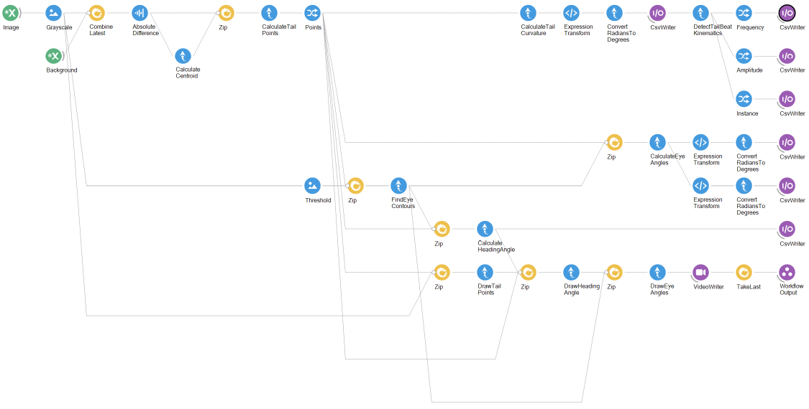
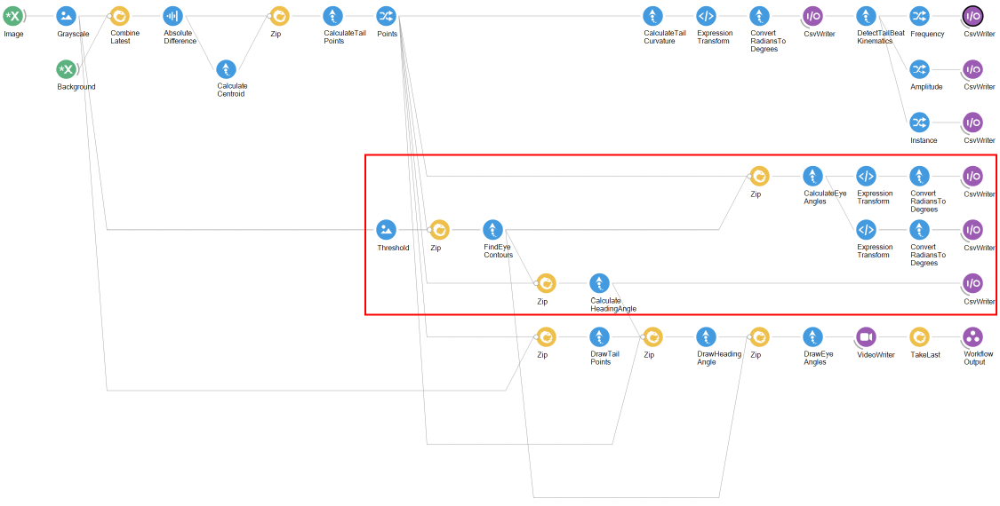
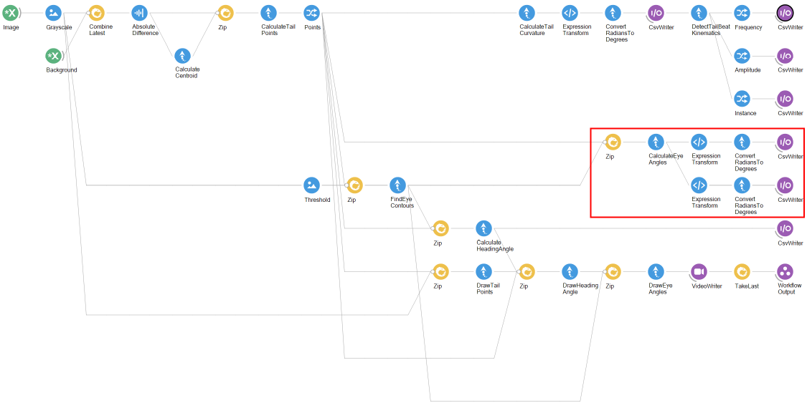
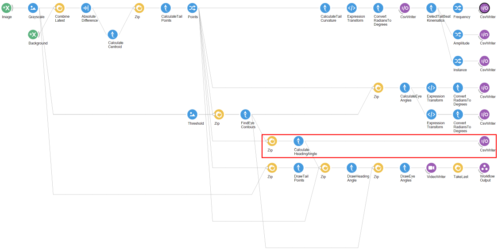
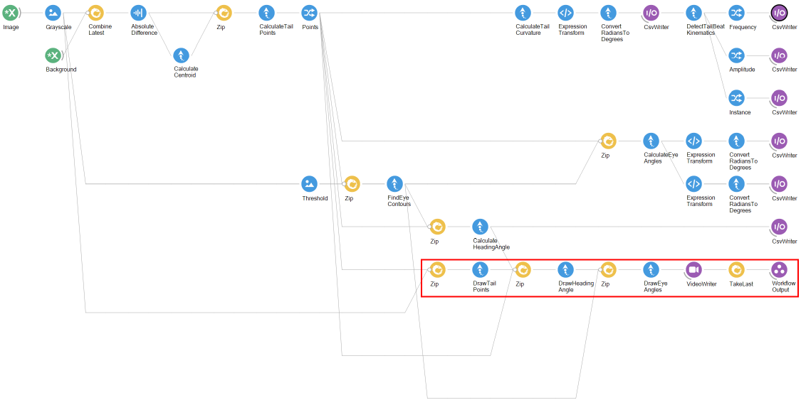

# BonZeb

# Behavioural Tracking and Analysis
BonZeb was designed to perform rapid behavioural tracking and analysis of zebrafish.
BonZeb behavioural tracking seamlessly integrates with Bonsai to enable flexible and robust tracking paradigms.
BonZeb provides nodes to perform tail curvature analysis, tail beat analysis, eye angle analysis, and more.

# Basic behavioural tracking and analysis
Most behavioural tracking protocols in BonZeb adhere to the following pipeline:

Video is processed using background subtraction.
The background subtracted image is thresholded to obtain a binary image.
Connected components are calculated from the pixels of the binary image.
The centroid of the connected component corresponding to the animal is then used to calculate points along the tail of the animal.
The angles between each of these points is calculated and normalized to the heading angle.
The tail angles can then be used to analyze tail beat kinematics.
Below is an example of a Bonsai workflow which can implement this behavioral tracking and analysis pipeline using BonZeb.

The `CameraCapture` node generates images of the animal.
These images are then converted to grayscale using the `Grayscale` node.

The grayscale images are then passed onto a `CalculateBackground` node to calculate the background as the darkest or lightest pixels over time.
The grayscale image and the background are then zipped together using a `Zip` node.
The background is then subtracted from incoming images using the `AbsoluteDifference` node.

Following background subtraction, the centroid is calculated using the `CalculateCentroid` node.
The `CalculateCentroid` node performs a threshold to create a binary image.
The raw image moments are then calculated from the binary image moments.
The center of mass derived from the raw image moments is taken as the centroid of the animal.
The background subtracted image and the centroid are zipped together with `Zip`.
These are then passed to the `CalculateTailPoints` node, which searches for the tail points in the image, given the centroid.

The tail points are then passed to the `CalculateTailCurvature` node to normalize and compute the angle between successive points.
These angles, commputed in radians, are then converted to units of degrees using the `ConvertRadiansToDegrees` module.
The `DetectTailBeatKinematics` node receives the tail angles as input and computes the tail beat frequency, amplitudes, and bout instance.
The angles and the tail kinematics are saved to seperate csv files using `CsvWriter` nodes.

This pipeline sets up the basis for tracking in more complex online and offline workflows.

# Timed online tracking
The following workflow sets up a more complex system.

Here, things are organized into `GroupWorkflows`.
Below shows what is inside the `VideoAcquisition` group.

All that happens inside the `VideoAcquisition` group is the `CameraCapture` node broadcasts images to the workflow using a `PublishSubject` node called `Image`.
To use a specific camera module, simply change the `CameraCapture` node to a similar node which produces the `IplImage` data type.
Below is what happens inside the `CalculateBackground` group node.

The background is calculated using the `CalculateBackground` node.
When the user believes that the background has been sufficiently extracted from the live video, the user presses the `Tab` key on the keyboard.
When the `Tab` key is pressed, the background calculate stops and the `Tracking` group is initiated.

Inside the `Tracking` group, there is a lot of overlap with the previous example.
The images from the camera are combined with the background followed by background subtraction.
Once the centroid is calculated, the tail points are calculated followed by the the tail angles.

Instead of saving all of the tail kinematic data into a single csv file, we select each value (frequency, amplitude, and instance) and save each individually to a csv file.

We also introduce a protocol for tracking of the eyes and heading angle.

The eyes are tracked by taking a `Threshold` of the image.
The threshold value must be large enough such that the eyes are seperated into 2 distinct binary regions.
The image produced by this `Threshold` is zipped with the tail points and passed to the `FindEyeContours` function.
The `FindEyeContours` node finds the binary regions corresponding to the left and right eye.
These data are generated as a `ConnectedComponentCollection`.

The `ConnectedComponentCollection` generated by the `FindEyeContours` node contain the `ConnectedComponents` corresponding to each eye.
This output is zipped with the tail points and passed to the `CalculateEyeAngles` node.
The `CalculateEyeAngles` node uses information about the tail points and the binary regions of the eyes to effectively normalize and calculate each eye angle with respect to the heading angle.
The angle for the left and right eye are then saved using `CsvWriter` nodes.

The `ConnectedComponentCollection` produced from the `FindEyeContours` is zipped with the tail points and passed onto the `CalculateHeadingAngle` node.
The `CalculateHeadingAngle` node uses the centroids of each eye and the tail points to calculate the heading angle.
The heading angle is saved to file.

In the final branch of the `Tracking` group workflow, a video with the tracking data overlaid is saved to a `.avi` file using the `VideoWriter` node.
The `DrawTailPoints` node overlays the calculated tail points onto the image and produces a new image.
The `DrawHeadingAngle` node draws an arrow corrsponding to the heading angle onto the image.
The `DrawEyeAngles` node draws the angles of each eye onto the image.

The `Timer` group workflow sets the time for how long we would like to track live video.
The `Timer` group receives tracked video from the `Tracking` group and waits one minute until terminating the workflow.
The `WorkflowInput` node, represented as the `Source` to the group, is subscribed to by the `Background` subject using the `SubscribeWhen` node.
This mechanism is what tells the `Tracking` node to wait until the background has been calculated.

The `Timer` node sets the duration for how long tracking should proceed.
Setting the `Period` property of the `Timer` will adjust how long data will be collected.
When the `Timer` branch fires after the elapsed `Period`, the `Tracking` data stream stops, which is controlled by the `TakeUntil` and `TakeLast` nodes.

