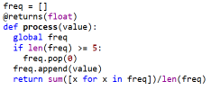

# BonZeb

# Closed-loop Head-fixed Stimulation
BonZeb's tracking methods can be used to implement closed-loop stimulation.
The examples provided address how closed-loop stimulation can be performed to stimulate optomotor swimming with OMR gratings.
These methods provide a general framework for users to develop closed-loop assays with other forms of stimulation. 

This folder contains the following sections:
1. [1D closed-loop with OMR](#1D-closed-loop-with-OMR)
2. [2D closed-loop with OMR](#2D-closed-loop-with-OMR)
3. [closed-loop with multi-gain trials](#closed-loop-with-multi-gain-trials)

# 1D Closed-loop with OMR
Below is an overview of the closed-loop OMR workflow for head-fixed fish.

It follows the general structure of the [timed online tracking](<../Behavioural Tracking and Analysis#timed-online-tracking>) workflow but uses the tracking pipeline from [Head-fixed tracking](<../Behavioural Tracking and Analysis#head-fixed-tracking>).
Below shows the contents of the `ClosedLoop` nested workflow.

Tracking starts when the workflow subscribes to the `Image` subject with the `KeyDown` node.
The `Keydown` node is set to trigger when the `Tab` key is pressed.
In head-fixed animals, there is no need to perform a background subtraction on the images.
Thus, the latest images are combined with a fixed point, generated by the `CreatePoint2f` node.
The `X` and `Y` properties of the `CreatePoint2f` node must be set to the coordinates in the image which represent the animal's centroid.
The tracking pipeline calculates the tail points and the mean tail curvature.
The tail angle is converted into degrees and saved using the `CsvWriter` node.
The tail beat frequency is calculated from the tail angle.

The tail beat frequency gets divided by -20.
Thus, if the tail beat frequency produces a value of 20, the output of the `Divide` node is -1.
This value, representing the gain, is multiplied by the `Time` variable.

The original value of time is zipped together with the frequency multiplied value of time and added together.
The sum of these 2 values, generated by the `Add` node, is accumulated over time by the `Accumulate`.
This value is converted to a float type by the `ExpressionTransform` node and used to update the shader variable `phase` by the `UpdateUniform` node.

The result of this is that when the animal produces no movement, the frequency is 0 and thus the phase of the stimulus increases at a constant rate.
When the fish swims (tail beat frequency > 0), this value is converted into an equivalent time step and multipled by a gain factor.
Decreasing the value of `Divide` will result in increasing the gain value.
A moving average or similar function can be applied to the tail beat frequency over time (i.e. using a `PythonTransform` or `CSharpTransform` node) to simulate the effects of acceleration and deceleration as shown below.

