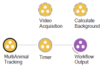
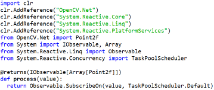
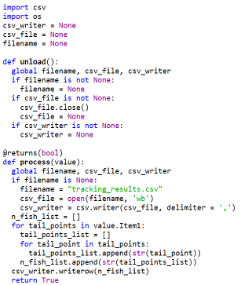

# BonZeb

# Multi-animal tracking
BonZeb's tracking methods can be used to perform behavioural tracking of multiple animals.
The methods used for multi-animal tracking will depend on the specific application.

This folder contains the following sections:
1. [Free-swimming](#free-swimming)
2. [Free-swimming with OMR](#free-swimming-with-OMR)
3. [Free-swimming with multi-prey](#free-swimming-with-multi-prey)
4. [Head-Fixed](#head-fixed)
5. [Seperate Wells](#seperate-wells)

# Free-Swimming
Below is an overview of the method we used for tracking multiple free-swimming animals.

We use the same basic structure for multi-animal tracking as described in [Timed online tracking](<../Behavioural Tracking and Analysis#timed-online-tracking>).
The differences between that workflow and this workflow are contained within the `MultiAnimalTracking` nested workflow. 
Inside the `MultiAnimalTracking` workflow is shown below.

To track the tail angles of multiple fish simultaneously, the first step is to calculate the centroids of all the fish at once.
We perform a background subtraction on the incoming images by combining the `Image` with the `Background` and calculating the `AbsoluteDifference` between them.
We then use a `Threshold` to acquire a binary image.
We pass the output of the `Threshold` node to a `FindContours` node.
The `FindContours` node will compute the contours of the binary regions of the image.
Setting the `MaxArea` and `MinArea` properties can help to discard regions of the binary image that do not correspond to any of the positions of the fish.
The output of the `FindContours` node is passed to the `BinaryRegionAnalysis` node.
The `BinaryRegionAnalysis` node computes the properties of binary regions that are seperated in the image.
The output of the `BinaryRegionAnalysis` node is a `ConnectedComponentCollection` which is essentially a list of all of the binary regions and their associated properties that were computed in the image.

The output of the `BinaryRegionAnalysis` node is zipped with the background subtracted image produced by the `AbsoluteDifference` node.
The contents of the `Zip` are then processed by a `SelectMany` node called `TrackMultipleAnimals`.

It is critical that the `TrackMultipleAnimals` node is a type of `SelectMany` node.
The input to the `TrackMultipleAnimals` node is split into seperate items.
`Item1` represents the `ConnectedComponentCollection` and `Item2` represents the background subtracted frame.
The `ConnectedComponentCollection` is collapsed into a single `ConnectedComponent` object using the `Concat` node.
The `Centroid` of the `ConnectedComponent` object is accessed and combined with the background subtracted image.
When we use the `Concat` function, we concatenate the `ConnectedComponentCollection` into a single `ConnectedComponent`.
When `Concat` is used in this way inside of a `SelectMany`, each `ConnectedComponent`contained within the `ConnectedComponentCollection` gets projected and processed into seperate windows.
Thus, the workflow contained within the `TrackMultipleAnimals` node is projected into as many windows as there are individual `ConnectedComponent` objects contained in the `ConnectedComponentCollection`.
The combined background subtracted image and centroid are then passed as input to a `CreateObservable` node with the name `CalculateTailPoints`.

The `CreateObservable` node named `CalculateTailPoints` node generates an observable sequence for each input.
The input, containing the background subtracted image and the centroid, are then passed to the `CalculateTailPoints` module.
The tail points are calculated and passed as output from the `CreateObservable` node called `CalculateTailPoints`.

The output of the `CreateObservable` node is a type of `Observable` containing a list of points corresponding to the points calculated along the tail.
This output is passed to a `PythonTransform` node.

The `PythonTransform` node essentially parellelizes the operation of calculating the tail points of all fish by subscribing to the `Observable` using a task pool scheduler.
Below is the contents of the `PythonTransform` node.

The `Observable` outputs are then merged together using the `Merge` node and added into a list using the `ToList` node.
The final result is a list of arrays of tail points.
This is sent as the final output from the `SelectMany` node titled `TrackMultipleAnimals`.

This output is processed by a `PythonTransform` node, which generates the final output of the `MultiAnimalTracking` workflow.

The `PythonTransform` node processes and saves the list of arrays of tail points to a csv file called `tracking_results.csv`.
The columns of the csv file represent the data for each fish.
The rows represent the data for all fish in each frame.
Below is the contents of the `PythonTransform` node which performs this process.

