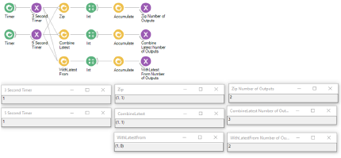
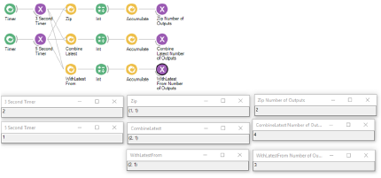
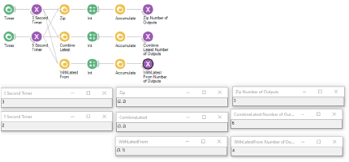

# BonZeb

# Combinators - Zip, CombineLatest, WithLatestFrom
Combinators are a class of operators which are very diverse and can be very useful for building Bonsai scripts. 
`Zip`, `CombineLatest`, and `WithLatestFrom`, are essential combinators to understand.
Each operator works by combining individual elements from multiple data streams into a single data stream consisting of multiple elements.
The behavior of each operator differs in the timing and content of their outputs.

`Zip` produces output only when each of the previous data streams produces a value. 
Both data streams must produce a new value for `Zip` to generate a single output. 
The timing of `Zip` is limited by the timing of the slower of the two input data streams and the output will always link the sequence of both inputs together. 

`CombineLatest` produces an output each time either of the input data streams generates a new value. 
Thus, the timing of `CombineLatest` is faster than the timing of either of the two input data streams and the output will consist of the most recent combination of inputs.
`WithLatestFrom` produces an output each time the driver sequence produces a value. 
The timing of `WithLatestFrom` is the same as the driver sequence but contains the most recent combination of both input streams from when the driver sequence produced a value.

To illustrate this difference, two `Timer` nodes are used. 
One produces a value every 3 seconds and the other produces a value every 5 seconds.
The outputs of each `Timer` are combined in 3 seperate data streams using `Zip`, `CombineLatest`, and `WithLatestFrom`.
Every time the combinators produces a value, an `Int` of 1 is accumulated with an `Accumulate` node to observe the total number of outputs from each combinator. 
As shown in the example below, the difference between combining data streams with `Zip`, `CombineLatest`, and `WithLatestFrom` is in the content and timing of their output.

At the start of the workflow, both timers produce a value of 0.
Upon starting the workflow, all 3 combinators are the same in that each combined the two streams and produced a single output.

After running the workflow for 5 seconds, the different behaviours of each combinator can be observed.
The `Zip` node produced a new value only after both timers produced a value, so the total number of outputs is 2. 
The `CombineLatest` module produced the same output as `Zip`, except the number of outputs was 3.
This is because the `CombineLatest` node produced a value when the 3 second timer fired and another value when the 5 second timer produced a value. 
`WithLatestFrom` produced a value when the 3 second timer fired but did not produce a value when the 5 second timer fired because the 3 second timer was set as the driver sequence.

After 6 seconds, the 3 second timer produced a second value. 
The output of `Zip` did not change, because both sequences had not produced a second value, only the 3 second timer produced a value. 
However, both `CombineLatest` and `WithLatestFrom` produced a new value.
Since the 3 second timer produced a new value, `CombineLatest` and `WithLatestFrom` generated the same value and the total number of outputs increased by 1 for both.

After just 10 seconds, the outputs of these 3 different combinators start to diverge. 
`Zip` produced a value of (2, 2), despite the fact that the 3 second timer had produced a 3 when the 5 second timer had produced a 2 value. 
The reason for this is because `Zip` combines the data elements from both input data streams in sequence. 
In the case of using `Zip`, values from the 3 second timer were slowed down or limited by the rate of firing of the 5 second timer. 
`CombineLatest`, however, produced a new value every time a value was received from either the 3 second timer or the 5 second timer.
While `CombineLatest` always combines the most recent values, it produces more outputs than either of the sequences upstream.
`WithLatestFrom` synchronizes the most recent values from both data streams contingent on the outputs from the driver sequence. 
Thus, `WithLatestFrom` produced a value when the 3 second timer fired but did not generate a new output when the 5 second timer fired.

Consider the exact same scenario except using 2 timers that are set to fire at the same time of 5 seconds. 
Despite the fact that the timers are both set to fire at the same time, their timings are not synchronized and thus their timings are off.
This is an important thing to keep in ming when building pipelines.
