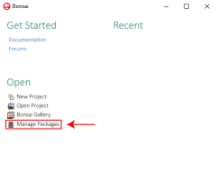

# BonZeb

# Accessing the Package Manager
Bonsai’s package manager is integrated into Bonsai’s interface and provides a convenient way to install online and local bonsai packages to the Bonsai IDE.
Users can access the package manager from the `Getting Started` window.

Users can also access the package manager from within the Bonsai IDE.
The package manager can be accessed by going to the `Tools` menu and selecting `Manage Packages...`.

This brings up the package manager window. 
On the left side, users can select and view packages which are currently installed by selecting the `Installed packages` tab and selecting `All`.
This will show all of the Bonsai packages and package dependencies that have been installed in the packages section.

If you select one of the installed packages in the packages section, an option to uninstall will appear.
If you select uninstall, this will remove the package from the Bonsai IDE.
Note: packages which have other packages dependant on them cannot be uninstalled until all of the dependant packages are uninstalled first.

When in the online section, an option to install a new package will appear. 
In the online section, you can browse Bonsai’s core packages from the Bonsai packages section or go to community packages to view packages that have been developed and made available online by the community. 
You can also use the search bar to look for specific packages online. 
